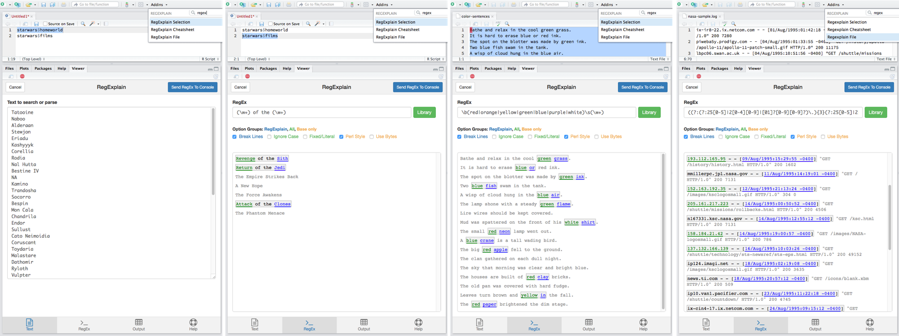

RegExplain
================

#### *Regular expressions are tricky.* RegExplain *makes it easier to see what you’re doing.*

<!-- [](commits/master) -->

 [](http://www.repostatus.org/#active)
[](https://cran.r-project.org/package=regexplain)
<!-- [](/commits/master) -->

<!-- Links -->

**RegExplain** is an RStudio addin that helps you interactively build up
your regular expressions. Inspired by [RegExr.com](https://regexr.com/)
and `stringr::str_view()`.

## Installation

Installation is easy with `devtools`

``` r
devtools::install_github("gadenbuie/regexplain")
```

or for hands-free installation

    source("https://install-github.me/gadenbuie/regexplain")

## RegExplain in Action

#### Overview


#### Regular Expressions Library


#### Try the Built-In Examples


## R Studio Addin

The main feature of this package is the R Studio Addin **RegExplain
Selection**. Just select the text or object containing text (such as the
variable name of a vector or a data.frame column) and run **RegExplain
Selection** from the RStudio Addins
dropdown.


The addin will open an interface with 4 panes where you can

  - edit the **text** you’ve imported
  - build up a **regex** expression and interactively see it applied to
    your text
  - test the **output** of common string matching and replacement
    functions from `base` and `stringr`
  - and refer to a **help**ful cheatsheet


When you’re done, click on the **Send Regex to Console** to send your
regex expression to… the
console\!

``` r
> pattern <- "\\b(red|orange|yellow|green|blue|purple|white|brown)(?:\\s(\\w+))?"
```

Notice that *RegExplain* handled the extra backslashes needed for
storing the RegEx characters `\b`, `\s`, and `\w`. Inside the gadget you
can use regular old regular expressions as you found them in the wild
(hello, [Stack
Overflow](https://stackoverflow.com/questions/tagged/regex)\!).

### Help and Cheat Sheet

The **Help** tab is full of resources, guides, and R packages and
includes an easy-to-navigate reference of commonly used regular
expression syntax.


Open **RegExplain Cheatsheet** from the R Studio Addins drop down to
open the regex reference page in the Viewer pane without blocking your
current R session.

### Import Your Text

There are two ways to get your text into *RegExplain*. The first way was
described above: select an object name or lines of text or code in the R
Studio source pane and run **RegExplain Selection**. To import text from
a file, use **RegExplain File** to you import the text you want to
process with regular expressions.

When importing text, *RegExplain* automatically reduces the text to the
unique entries and limits the number of lines.



### Regular Expressions Library

The *RegExplain* gadget also includes a regular expressions library in
the **RegEx** tab. The library features common regular expressions,
sourced from [qdapRegex](https://github.com/trinker/qdapRegex) and
[Regex Hub](https://projects.lukehaas.me/regexhub), with several
additional patterns.

The full library is stored as a JSON file in
[inst/extdata/patterns.json](/inst/extdata/patterns.json), feel free to
contribute patterns you find useful or use regularly via pull
request.


## View Static Regex Results

*RegExplain* also provides the function `view_regex()` that you can use
as a `stringr::str_view()` replacement. In addition to highlighting
matched portions of the text, `view_regex()` colorizes groups and
attempts to colorize the regex expression itself as well.

``` r
text <- c("breakfast=eggs;lunch=pizza",
          "breakfast=bacon;lunch=spaghetti", 
          "no food here")
pattern <- "((\\w+)=)(\\w+).+(ch=s?p)"

view_regex(text, pattern)
```


``` r
t_nested <- "anestedgroupwithingroupexample"
r_nested <- "(a(nested)(group(within(group))(example)))"
view_regex(t_nested, r_nested)
```


## Notes

Regular expressions are nothing if not a collection of corner cases.
Trying to pass regular expressions through Shiny and HTML inputs is a
bit of a labyrinth. For now, assume any issues or oddities you
experience with this addin are entirely my fault and have nothing to do
with the fine packages this addin is built on. If you do find an issue,
[please file an issue](https://github.com/gadenbuie/regexplain). Pull
requests are welcomed\!
